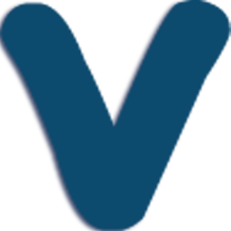
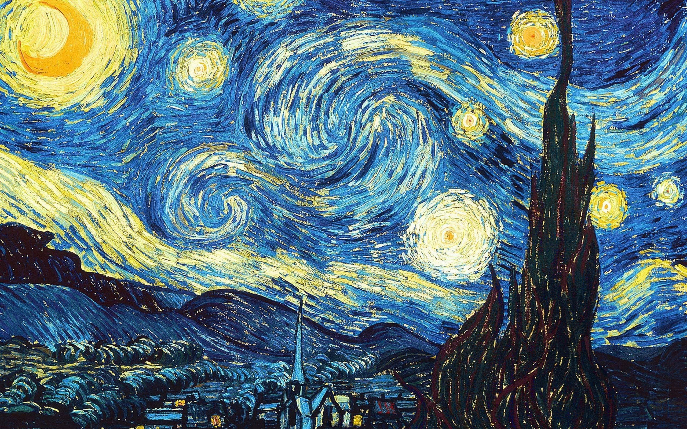

Artes Visuais I 

> Imagem ilustrativa pintada por Van Gogh

### Ajustes e melhorias

O projeto ainda está em desenvolvimento e as próximas atualizações serão voltadas nas seguintes tarefas:

- [x] Tarefa 1
- [x] Tarefa 2
- [x] Tarefa 3
- [ ] Tarefa 4
- [ ] Tarefa 5

## 🤝 Colaboradores

Agradecemos às seguintes pessoas que contribuíram para este projeto:

<table style="margin: auto; display: table;">
  <tr>
    <td align="center">
      <a href="#">
         
        
          <b>Kaike Sathler</b>
        
      </a>
    </td>
    <td align="center">
      <a href="#">
         
        
          <b>Kauã Rossanezi</b>
        
      </a>
    </td>
  </tr>
</table>
  
Artes Visuais © 2023 by Kaike Sathler is licensed under CC BY 4.0 